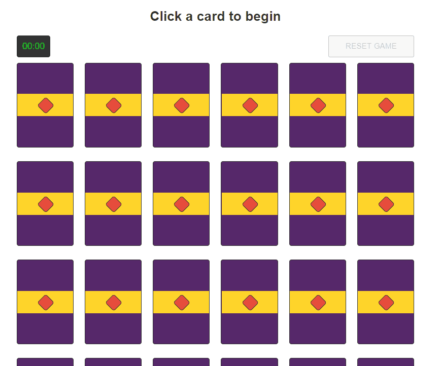

# memory-match-game

> A simple memory game where you match images

## memory-match-game is built with

Vue, ES6, Stylus, Webpack, Babel

## Example Gameplay



## Features

- Game Timing
- Anti-cheating measures (card backgrounds are not inspectable)
- Works as a PWA (offline support)
- Memes

## Running locally

To run a production version of this game locally, first run the command(s):

`git clone ... && cd memory-match-game && npm i && npm run start:prod`

Then navigate to `localhost:3000`

## Build Setup

``` bash
# install dependencies
npm install

# serve with hot reload at localhost:8080
npm run dev

# build for production with minification
npm run build

# build and serve production at localhost:3000
npm run start:prod

# build for production and view the bundle analyzer report
npm run build --report

# run unit tests
npm run unit

```
